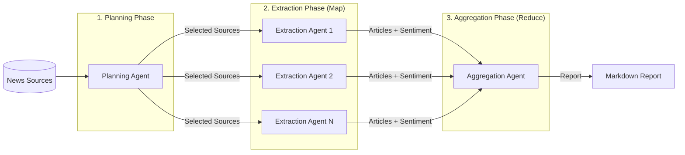

# Nexus


An AI-driven news aggregator that orchestrates LLMs to ingest, cross-reference, and synthesize multi-source reporting into structured, unbiased event summaries. The system prevents cognitive bias by autonomously gathering diverse viewpoints from global news sources.

## Features

- Multi-source news aggregation from 17+ global outlets
- AI-powered cross-referencing and synthesis
- Sentiment analysis (positive/negative/neutral) for each source
- Structured comparison tables across different viewpoints
- Context-aware extraction using map-reduce pattern

## How It Works

Nexus uses a three-phase pipeline with specialized AI agents:



1. **Planning Agent**: Selects the most relevant news sources for your topic
2. **Extraction Agents**: Navigate each source website, search for coverage, and extract article details with sentiment analysis
3. **Aggregation Agent**: Synthesizes all findings into a comparison table and summary

## Prerequisites

- **Python 3.12+**: Required runtime version
- **Node.js**: Must be installed for Playwright MCP server (`npx @playwright/mcp@latest`)
- **DeepSeek API Key**: Required for LLM operations

## Installation

1. Clone the repository:
   ```bash
   git clone https://github.com/chenyanchen/nexus.git
   cd nexus
   ```

2. Install dependencies with `uv`:
   ```bash
   uv sync
   ```

3. Set up your API key:
   ```bash
   export DEEPSEEK_API_KEY=your_api_key_here
   ```

## Usage

```bash
# Basic usage
python main.py --topic "Your news topic here"

# With custom source count
python main.py --topic "Climate summit 2024" --num-sources 5

# Short form
python main.py -t "US election" -n 10
```

### Arguments

| Argument | Short | Required | Default | Description |
|----------|-------|----------|---------|-------------|
| `--topic` | `-t` | Yes | - | News topic to search for |
| `--num-sources` | `-n` | No | 10 | Number of sources to process |

### Environment Variables

| Variable | Required | Description |
|----------|----------|-------------|
| `DEEPSEEK_API_KEY` | Yes | API key for DeepSeek LLM |

## Output

Generated reports are saved in the `runs/` directory with timestamps (e.g., `runs/20240115_143052/report.md`).

### Example Output

```markdown
# News Aggregation Report: Climate Summit 2024

**Generated:** 2024-01-15T14:30:52
**Sources Checked:** 10
**Sources with Coverage:** 8

## Summary

Global media coverage shows consensus on the urgency of climate action...

## Media Comparison Table

| Country/Organization | Media Name | Article | Sentiment | Core Viewpoint |
| -------------------- | ---------- | ------- | --------- | -------------- |
| United States | CNN | [Climate talks...](url) | neutral | Balanced coverage focusing on... |
| Russia | RT | [Western nations...](url) | negative | Critical stance toward... |
| France | France 24 | [Historic agreement...](url) | positive | Optimistic framing of... |
```

## News Sources

Nexus aggregates from 17+ global news outlets including:

- **International**: UN News
- **Americas**: CNN, AP, CTV News
- **Europe**: France 24, Telegraph, Die Zeit, ANSA
- **Asia**: NHK, Yonhap
- **Middle East**: Times of Israel, Press TV
- **Others**: RT, TASS, Kyiv Independent

## Contributing

See [CLAUDE.md](CLAUDE.md) for technical architecture details and development guidelines.

## License

MIT License - see [LICENSE](LICENSE) file for details.
